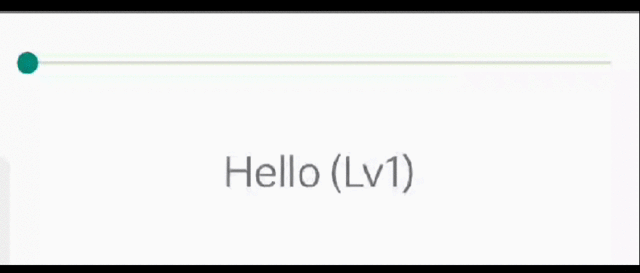

# Background

This is repo is relate to the stackoverflow question: [Why my component provided from ViewManager is never resize after setText?]()

I create this repo to let us reproduce the issue mentioned in the question easily.

# Question

The `CustomView` in native work as expect:

While the `CustomView` in the react-native page will never remeasure and relayout:

Why the `CustomView` will never remeasure and relayout in react-native page?
