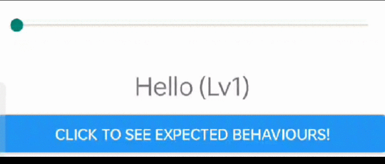

# Background

This is repo is relate to the stackoverflow question: [Why my component provided from ViewManager is never resize after setText?](https://stackoverflow.com/questions/73671725/why-my-component-provided-from-viewmanager-is-never-resize-after-settext)

I create this repo to let us reproduce the issue mentioned in the question easily.

# Question

The `CustomView` in native work as expect:


While the `CustomView` in the react-native page will never remeasure and relayout:



Why the `CustomView` will never remeasure and relayout in react-native page?

# How to reproduce?

```shell script
$ git clone https://github.com/spirytusz/test_rn.git
$ cd test_rn
$ react-native run-android
```

Then just wait for the app launched. 

The first page is react-native page named `MainActivity` where the `CustomView` not remeasure and relayout.

To see expect behaviour of `CustomView`, click the button to another page named `SecondActivity`, you can see expect behaviour.
